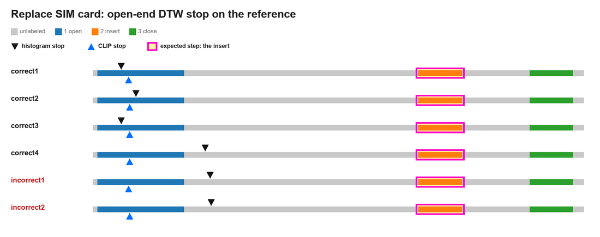
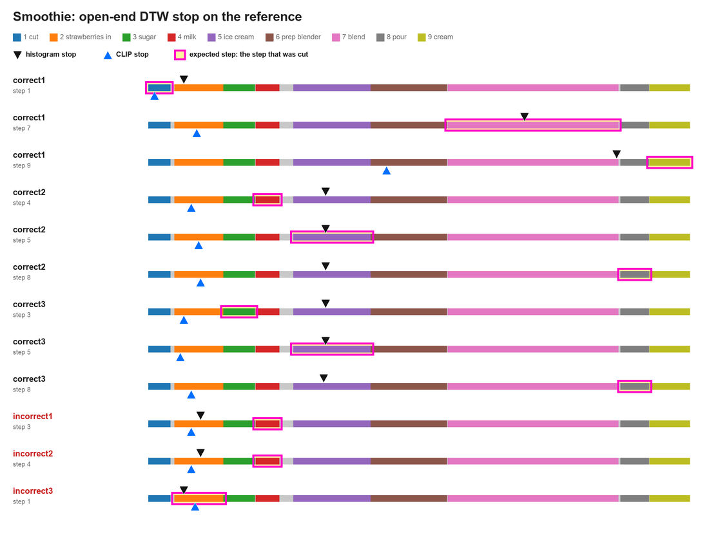
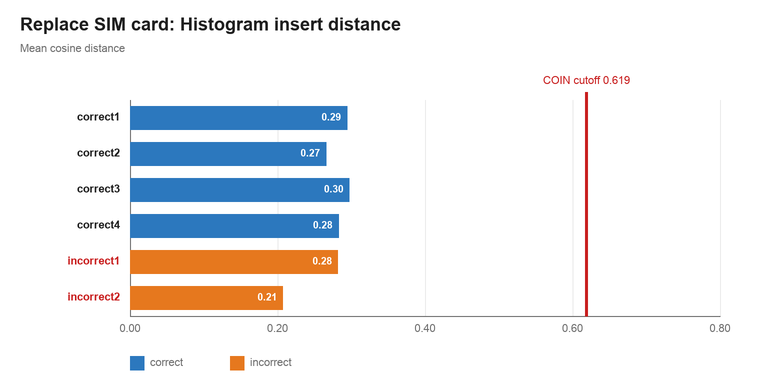
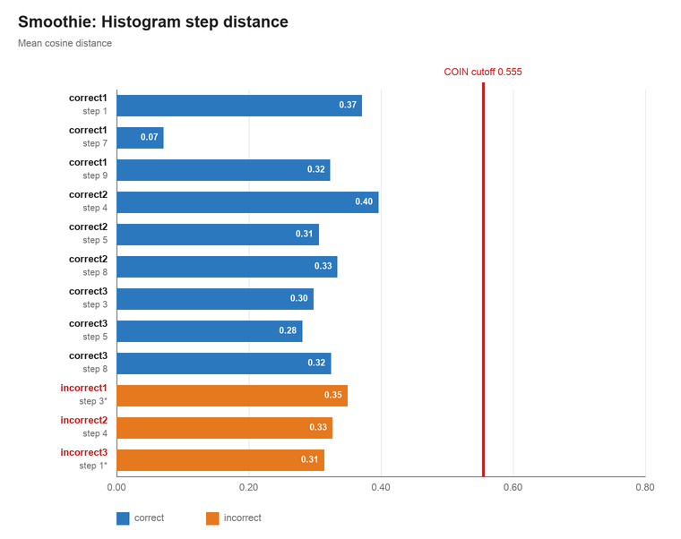
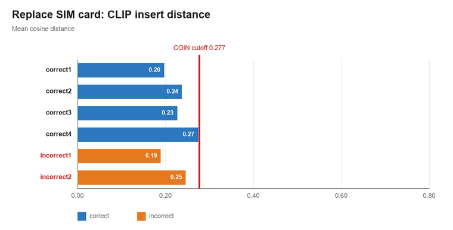
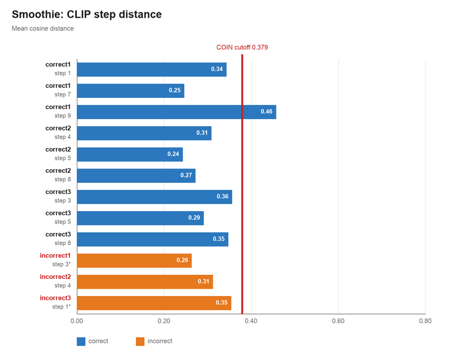

# No-ML and ML baselines

Two tasks, Replace SIM card and Strawberry smoothie. Phone recordings are cut in the middle of a step and compared with a reference video. The no-ML baseline uses histogram frame features and the ML baseline uses CLIP ViT-B/32 features. Both use DTW on cosine distance. A step is a deviation when its mean cosine distance is above the cutoff.

Recording names: Replace SIM card has correct1 to correct4 and incorrect1 to incorrect2, where the SIM is inserted wrongly. Smoothie has correct1 to correct3, and incorrect1 (sugar skipped), incorrect2 (chocolate milk instead of milk) and incorrect3 (strawberries not cut).

## Cutoffs

The cutoff is the mean plus two standard deviations of the mean cosine distance along the global DTW path, over all pairs of COIN videos. Replace SIM card uses 48 COIN videos (1,128 pairs) and Smoothie uses 17 (136 pairs). Both tasks use the whole-video cutoff, taken over the full DTW path rather than per step.

| Task             | Histogram     | Cutoff | CLIP          | Cutoff |
| ---------------- | ------------- | ------ | ------------- | ------ |
| Replace SIM card | 0.413 ± 0.103 | 0.619  | 0.200 ± 0.039 | 0.277  |
| Smoothie         | 0.362 ± 0.096 | 0.555  | 0.294 ± 0.043 | 0.379  |

## Open-end DTW

Open-end DTW places every frame of the crop onto the reference and stops at the reference frame with the lowest accumulated cost. A correct mapping stops inside the expected step, boxed in magenta. The black triangle is the histogram stop and the blue triangle is the CLIP stop.

### Replace SIM card

Every recording is cut in the middle of the insert and mapped onto the first reference.

No stop reaches the insert, for either feature.

### Smoothie

Each incorrect recording is tested on its mistake. A skipped step has no frames, so that recording is cut in the middle of the next step. Each correct recording is tested on three steps drawn at random with seed 0.

Histogram stops in the expected step for 4 of 12 cuts and CLIP for 2 of 12. CLIP stops around step 2 for most cuts, and histogram around step 5.

## Segment DTW

Segment DTW uses the annotated step boundaries. The recording frames of the step being done at the cut, up to the cut, are aligned with the whole reference step. Replace SIM card uses the first reference only. A star marks a skipped step, where the step done instead is compared with the reference's skipped step.

### Histogram

### CLIP

### Result

Neither baseline catches any mistake on either task, with open-end or segment DTW. Recall and precision are 0% for both tasks. The only bar above a cutoff is CLIP on Smoothie correct1 step 9, a false positive.

| Task             | Precision | Recall |
| ---------------- | --------- | ------ |
| Replace SIM card | 0%        | 0%     |
| Smoothie         | 0%        | 0%     |

## Zero-shot LLM baseline

Gemini 3.5 Flash-Lite sees the full reference, the phone crop, and the reference step checklist, with no examples. It names the current step and any deviation. The cuts are the same as above, and both tasks use the first reference only.

| Task             | Precision | Recall |
| ---------------- | --------- | ------ |
| Replace SIM card | 50%       | 50%    |
| Smoothie         | 75%       | 100%   |

On Replace SIM card, Gemini flags incorrect1, misses incorrect2, and flags correct4 as a false positive. On Smoothie it catches all three mistakes with the right step and reason. Its one false positive is a measuring pitcher instead of a glass in correct2. It also flags brown sugar instead of white sugar in correct1, at two cuts; we ignore these, since the type of sugar is not a mistake.

## Average time saved

Task time runs from the start of the first annotated step to the end of the last. Replace SIM card incorrect times are the recorded times, including the repair. A wrong smoothie cannot be repaired, so its time is the time already spent at the cut plus one average correct run. Time saved is the average incorrect time minus the average correct time, as a share of the average incorrect time.

| Task             | Average correct | Average incorrect | Time saved |
| ---------------- | --------------- | ----------------- | ---------- |
| Replace SIM card | 27.5 s          | 52.7 s            | 47.7%      |
| Smoothie         | 103.1 s         | 128.0 s           | 19.5%      |

