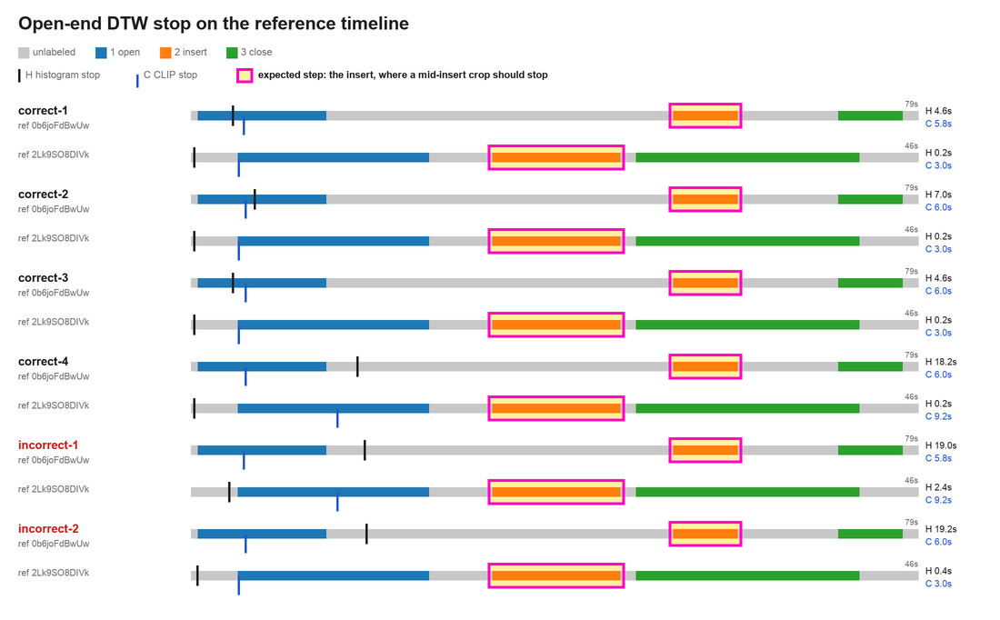
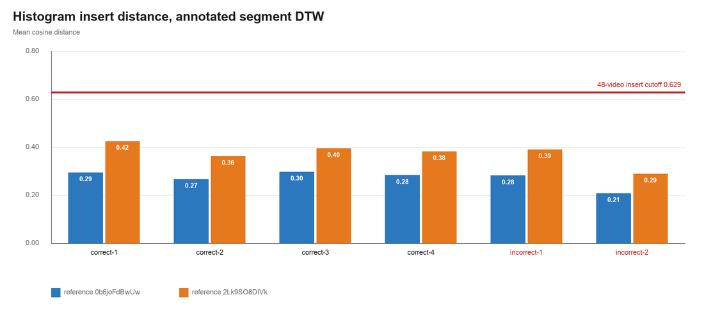
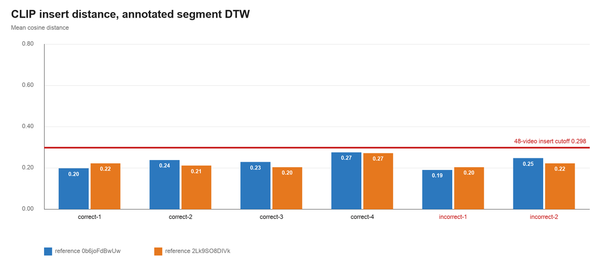

# Mid-insert deviation on ReplaceSIMCard

Six phone recordings are cut at the middle of step 2 and compared with two canonical videos. A deviation is a mean cosine distance above the cutoff from 1,128 full-video pairs.

Source: COIN task 141 and the recorded annotations, 5 October 2026.

## Methodology

The non-ML baseline is a histogram descriptor. Each frame, sampled at 5 fps, becomes a 16-bin hue histogram, an 8-bin saturation histogram, and a 4×4 grid of 9-bin gradient-orientation histograms. Each part is L2-normalized on its own, then the joined vector is L2-normalized. The ML baseline is a 512-D CLIP ViT-B/32 embedding, also L2-normalized. In both cases the local cost of pairing two frames is the cosine distance, one minus their dot product.

The threshold comes from the 48 canonical videos, both kept whole. Global DTW aligns every pair, 1,128 pairs. The score of a step is the mean cosine distance along the path while the reference frame is inside that step. The cutoff is that mean plus two standard deviations. The same rule is used for the whole video.

The phone videos are four correct recordings and two incorrect ones. The mistake is in step 2, putting the SIM in. Each recording is cut at the middle of its own step 2 annotation, before the mistake is repaired and before the tray is pressed back. Open-end DTW places every frame of that crop onto a reference and may stop before the reference ends. The stop is the reference frame with the lowest accumulated cost. The references are the first two files in the used folder, `0b6joFdBwUw` and `2Lk9SO8DIVk`. A step is a deviation when the average of those two path costs is above the 48-video cutoff.

The ablation gives DTW the annotated step instead of asking it to find the step. Step 1 uses the whole open on both videos. Step 2 uses the phone frames up to the midpoint and the entire reference insert. Global DTW then runs only inside that pair of segments.

## Cutoffs from the 48 full videos

Mean cosine distance ± standard deviation over 1,128 pairs. Cutoff is mean + 2 standard deviations.

| Step                       | Histogram distance | Histogram cutoff | CLIP distance | CLIP cutoff |
| -------------------------- | ------------------ | ---------------- | ------------- | ----------- |
| Step1: Open the slot       | 0.431 ± 0.114      | 0.659            | 0.196 ± 0.044 | 0.283       |
| Step2: Put the SIM in      | 0.401 ± 0.114      | 0.629            | 0.197 ± 0.050 | 0.298       |
| Step3: Press the tray back | 0.417 ± 0.113      | 0.643            | 0.202 ± 0.047 | 0.296       |
| Whole video                | 0.413 ± 0.103      | 0.619            | 0.200 ± 0.039 | 0.277       |

## Open-end DTW does not land on the insert

Each bar is one reference, in seconds from the start of its annotated region. Gray is unlabeled. Blue is the open, orange is the insert, and green is the close. The black tick is where histogram open-end DTW stops. The blue tick is where CLIP stops. The expected step, the insert, is boxed in magenta. A correct mapping of a mid-insert crop would stop inside that box.

Every tick falls in the open or in the gray gap before the insert. The path never reaches the orange band, so step 2 has no cosine distance and cannot cross 0.629 (histogram) or 0.298 (CLIP). Open-end DTW reports no deviation.

## Annotated segment DTW still stays under the cutoff

The phone insert is cut at its midpoint and aligned with the whole reference insert. The bars are the mean cosine distance inside that segment. The line is the 48-video insert cutoff. A deviation would be a bar above the line.

| Recording   | Truth            | Histogram mean | CLIP mean | Deviation |
| ----------- | ---------------- | -------------- | --------- | --------- |
| correct-1   | Correct          | 0.360          | 0.209     | No        |
| correct-2   | Correct          | 0.314          | 0.223     | No        |
| correct-3   | Correct          | 0.346          | 0.214     | No        |
| correct-4   | Correct          | 0.333          | 0.272     | No        |
| incorrect-1 | Incorrect insert | 0.336          | 0.196     | No        |
| incorrect-2 | Incorrect insert | 0.248          | 0.233     | No        |

The mean is the average of the two references. incorrect-2 is the closest histogram insert. incorrect-1 is the closest CLIP insert.

## Gemini on the same cuts, both references

Gemini 3.5 Flash-Lite sees one full reference and the phone crop, with the livestream prompt. It names the current step and whether that step deviates. The same six mid-insert cuts were scored against `0b6joFdBwUw` and against `2Lk9SO8DIVk`.

| Recording   | Truth            | 0b6joFdBwUw | 2Lk9SO8DIVk |
| ----------- | ---------------- | ----------- | ----------- |
| correct-1   | Correct          | Insert, no  | Insert, yes |
| correct-2   | Correct          | Insert, no  | Insert, no  |
| correct-3   | Correct          | Insert, no  | Insert, no  |
| correct-4   | Correct          | Insert, yes | Insert, no  |
| incorrect-1 | Incorrect insert | Insert, yes | Close, no   |
| incorrect-2 | Incorrect insert | Insert, no  | Close, no   |

Each cell is the step Gemini calls current, and whether it marks a deviation. On `2Lk9SO8DIVk` both incorrect crops are called a finished, correct insert, with the close underway.

| Reference   | Precision | Recall |
| ----------- | --------- | ------ |
| 0b6joFdBwUw | 1/2       | 1/2    |
| 2Lk9SO8DIVk | 0/2       | 0/2    |

Against `0b6joFdBwUw`, Gemini catches incorrect-1 and misses incorrect-2. correct-4 is a false positive. Against `2Lk9SO8DIVk` it misses both incorrect videos and flags correct-1, saying the SIM is being removed instead of inserted.

## Task time

Task time runs from the start of the first annotated step to the end of the last one in each recording. The incorrect recordings include the time spent noticing and repairing the wrong insert.

| Recording   | Truth            | Task time |
| ----------- | ---------------- | --------- |
| correct-1   | Correct          | 24.9 s    |
| correct-2   | Correct          | 28.0 s    |
| correct-3   | Correct          | 22.4 s    |
| correct-4   | Correct          | 34.9 s    |
| incorrect-1 | Incorrect insert | 61.2 s    |
| incorrect-2 | Incorrect insert | 44.2 s    |

| Average correct | Average incorrect | Difference | Time saved |
| --------------- | ----------------- | ---------- | ---------- |
| 27.5 s          | 52.7 s            | 25.1 s     | 47.7%      |

Time saved is the difference as a share of the average incorrect time. Catching the wrong insert when it happens would save about half of an incorrect attempt.