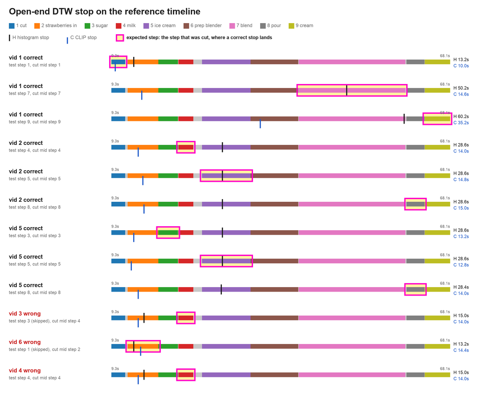
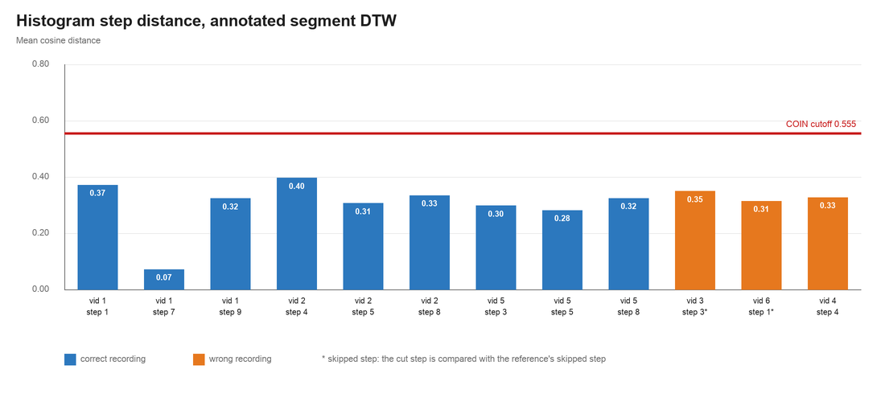
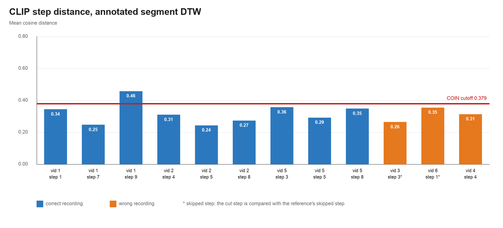

# Mid-step deviation on MakeStrawberrySmoothie

Six phone recordings are cut in the middle of a step and compared with one annotated reference video. A deviation is a mean cosine distance above the cutoff from 136 COIN video pairs.

Source: COIN task 95, the recorded and reference annotations, 5 October 2026.

## Methodology

The non-ML baseline is a histogram descriptor. Each frame, sampled at 5 fps, becomes a 16-bin hue histogram, an 8-bin saturation histogram, and a 4×4 grid of 9-bin gradient-orientation histograms. Each part is L2-normalized on its own, then the joined vector is L2-normalized. The ML baseline is a 512-D CLIP ViT-B/32 embedding, also L2-normalized. In both cases the local cost of pairing two frames is the cosine distance, one minus their dot product.

The threshold comes from the 17 COIN smoothie videos on the Hugging Face mirror, each cut to its annotated task section. All of them have the same three COIN steps in the same order. Global DTW aligns every pair, 136 pairs. The whole-video score is the mean cosine distance along the path, and the cutoff is that mean plus two standard deviations. The recordings use nine steps rather than COIN's three, so only the whole-video cutoff is used.

The reference is our own smoothie video, annotated with nine steps: cut strawberries, add strawberries, add sugar, add milk, add ice cream, prepare the blender, blend, pour, and spray cream. It is cut from the start of its first step to the end of its last, 9.3 s to 68.1 s.

The phone videos are three correct recordings and three wrong ones. Each wrong recording is tested on its mistake. vid 4 pours chocolate milk instead of milk (step 4) and is cut in the middle of step 4. vid 3 skips the sugar (step 3) and vid 6 does not cut the strawberries (step 1). A skipped step has no frames, so those two are cut in the middle of the next step they perform, step 4 and step 2. Each correct recording is tested on three steps drawn at random with seed 0: vid 1 on steps 1, 7 and 9, vid 2 on steps 4, 5 and 8, and vid 5 on steps 3, 5 and 8. That gives 12 cuts.

Open-end DTW places every frame of the crop onto the reference and may stop before the reference ends. The stop is the reference frame with the lowest accumulated cost. A correct mapping stops inside the step that was cut. The test-step distance is the mean path cost while the reference frame is inside the test step. A step is a deviation when that distance is above the COIN cutoff.

The ablation gives DTW the annotated step instead of asking it to find the step. The recording frames of the step being done at the cut, up to the cut, are aligned with the entire reference test step. For a skipped step this compares what the person did instead (the milk for vid 3, adding uncut strawberries for vid 6) with the reference step they skipped. Global DTW then runs only inside that pair of segments.

## Cutoffs from the 17 COIN videos

Mean cosine distance ± standard deviation over 136 pairs. Cutoff is mean + 2 standard deviations.

| Feature | Whole-video distance | Cutoff |
| --- | --- | --- |
| Histogram | 0.362 ± 0.096 | 0.555 |
| CLIP | 0.294 ± 0.043 | 0.379 |

## Open-end DTW rarely lands on the cut step

Each bar is the reference timeline from 9.3 s to 68.1 s, coloured by step. The expected step, the one that was cut, is boxed in magenta. The black tick is where histogram open-end DTW stops, and the blue tick is where CLIP stops. A correct mapping stops inside the box.

| Recording | Test step | Cut step | Histogram stop | Histogram distance | CLIP stop | CLIP distance |
| --- | --- | --- | --- | --- | --- | --- |
| vid 1 correct | 1 | 1 | step 2 | 0.369 | **step 1** | 0.297 |
| vid 1 correct | 7 | 7 | **step 7** | 0.084 | step 2 | none |
| vid 1 correct | 9 | 9 | step 7 | none | step 6 | none |
| vid 2 correct | 4 | 4 | step 5 | 0.376 | step 2 | none |
| vid 2 correct | 5 | 5 | **step 5** | 0.219 | step 2 | none |
| vid 2 correct | 8 | 8 | step 5 | none | step 2 | none |
| vid 5 correct | 3 | 3 | step 5 | 0.444 | step 2 | none |
| vid 5 correct | 5 | 5 | **step 5** | 0.187 | step 2 | none |
| vid 5 correct | 8 | 8 | step 5 | none | step 2 | none |
| vid 3 wrong | 3 (skipped) | 4 | step 2 | none | step 2 | none |
| vid 6 wrong | 1 (skipped) | 2 | **step 2** | 0.319 | **step 2** | 0.270 |
| vid 4 wrong | 4 | 4 | step 2 | none | step 2 | none |

Bold stops are correct. Histogram maps 4 of 12 cuts to the cut step and CLIP maps 2 of 12. CLIP stops near step 2, about 14 s into the reference, for 10 of the 12 cuts. Histogram usually stops in step 5, at 28.6 s, so it cannot reach cuts at steps 7 to 9. "None" means the path never reached the test step. No distance is above 0.555 (histogram) or 0.379 (CLIP), so open-end DTW reports no deviation, and none of the three wrong recordings is caught.

## Annotated segment DTW still stays under the cutoff

The bars are the mean cosine distance inside the annotated segment. The line is the COIN whole-video cutoff. A deviation would be a bar above the line. A star marks a skipped step, where the step being done at the cut is compared with the reference's skipped step.

| Recording | Test step | Truth | Histogram | CLIP | Deviation |
| --- | --- | --- | --- | --- | --- |
| vid 1 correct | 1 | Correct | 0.371 | 0.343 | No |
| vid 1 correct | 7 | Correct | 0.071 | 0.246 | No |
| vid 1 correct | 9 | Correct | 0.323 | 0.457 | CLIP only |
| vid 2 correct | 4 | Correct | 0.396 | 0.309 | No |
| vid 2 correct | 5 | Correct | 0.306 | 0.243 | No |
| vid 2 correct | 8 | Correct | 0.334 | 0.272 | No |
| vid 5 correct | 3 | Correct | 0.298 | 0.356 | No |
| vid 5 correct | 5 | Correct | 0.281 | 0.291 | No |
| vid 5 correct | 8 | Correct | 0.324 | 0.347 | No |
| vid 3 wrong | 3 | Sugar skipped | 0.349 | 0.263 | No |
| vid 6 wrong | 1 | Strawberries not cut | 0.314 | 0.354 | No |
| vid 4 wrong | 4 | Chocolate milk | 0.327 | 0.312 | No |

Histogram flags nothing. CLIP flags one correct step, the cream spray in vid 1, and none of the wrong ones. Even the skipped sugar is not separated: vid 3's milk frames against the reference sugar step score 0.263 with CLIP, below most correct steps.

## Gemini on the same cuts

Gemini 3.5 Flash-Lite sees the full reference, the phone crop, and the nine-step checklist, with the livestream prompt. It names the current step and lists any deviations. The 12 cuts are the same as above.

| Recording | Test step | Truth | Current step | Deviation flagged |
| --- | --- | --- | --- | --- |
| vid 1 correct | 1 | Correct | 1 | No |
| vid 1 correct | 7 | Correct | 7 | Yes, step 3: brown sugar instead of white |
| vid 1 correct | 9 | Correct | 9 | Yes, step 3: brown sugar instead of white |
| vid 2 correct | 4 | Correct | 4 | No |
| vid 2 correct | 5 | Correct | 5 | No |
| vid 2 correct | 8 | Correct | 8 | Yes, step 8: measuring pitcher instead of glass |
| vid 5 correct | 3 | Correct | 3 | No |
| vid 5 correct | 5 | Correct | none, task called finished | No |
| vid 5 correct | 8 | Correct | 7 | No |
| vid 3 wrong | 3 | Sugar skipped | 4 | Yes, step 3 skipped |
| vid 6 wrong | 1 | Strawberries not cut | 1 | Yes, step 1: strawberries not cut |
| vid 4 wrong | 4 | Chocolate milk | 4 | Yes, step 4: chocolate milk instead of milk |

| Precision | Recall |
| --- | --- |
| 3/6 | 3/3 |

Gemini catches all three mistakes and names the right step and the right reason for each. The three false positives are on correct recordings, and each points at a visible difference from the reference rather than a missed step: brown sugar in vid 1 (flagged at both later cuts) and a measuring pitcher in vid 2. The current step is right for 9 of the 12 cuts. It misses vid 5 at step 5, where it calls the task finished, and vid 5 at step 8, where it says blending instead of pouring. For vid 6 it names step 1, the skipped step, rather than step 2, the step that was cut.

## Task time

Task time runs from the start of the first annotated step to the end of the last one in each recording.

| Recording | Task time |
| --- | --- |
| vid 1 correct | 103.0 s |
| vid 2 correct | 94.7 s |
| vid 5 correct | 111.5 s |
| Average | 103.1 s |

A wrong smoothie cannot be repaired, so an incorrect attempt is assumed to be redone from the start. Its time is the time already spent when the cut is reached, measured from its first annotated step, plus one average correct run.

| Recording | Time at the cut | Redo | Incorrect time |
| --- | --- | --- | --- |
| vid 3 wrong | 28.4 s | 103.1 s | 131.5 s |
| vid 6 wrong | 2.0 s | 103.1 s | 105.0 s |
| vid 4 wrong | 44.5 s | 103.1 s | 147.6 s |

| Average correct | Average incorrect | Difference | Time saved |
| --- | --- | --- | --- |
| 103.1 s | 128.0 s | 25.0 s | 19.5% |

Time saved is the difference as a share of the average incorrect time. vid 6 skips its first step, so its task starts at step 2 and only 2.0 s have passed at the cut.
